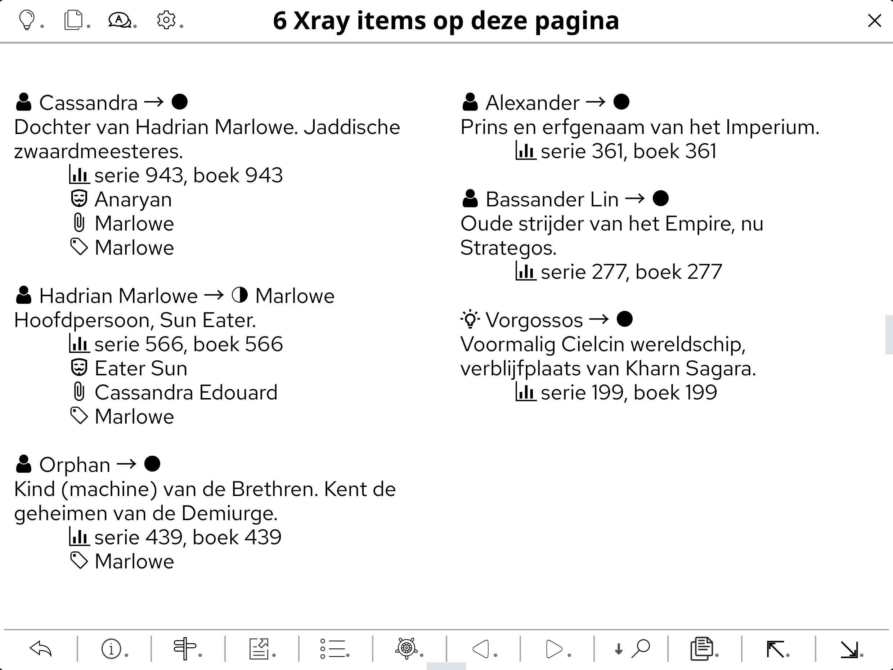
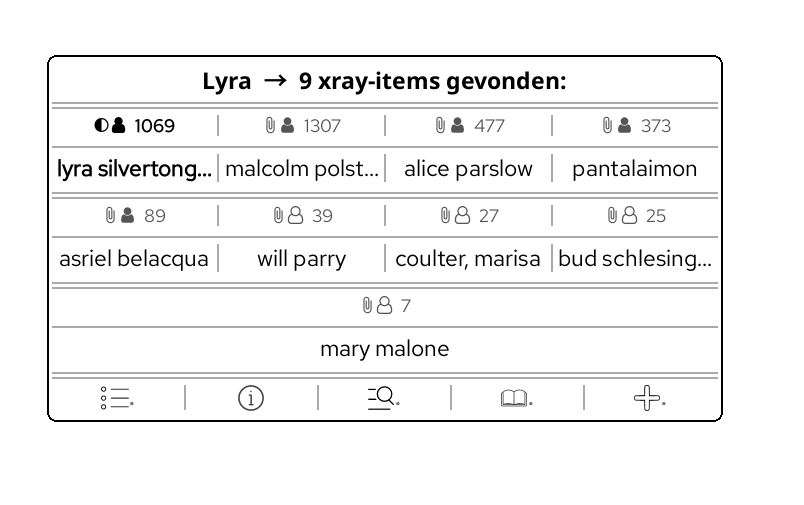
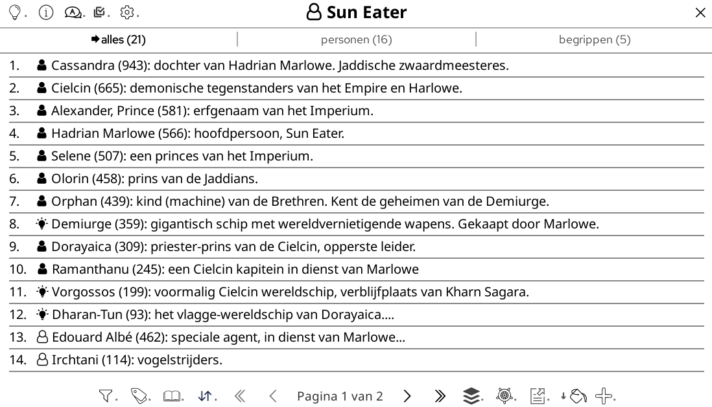
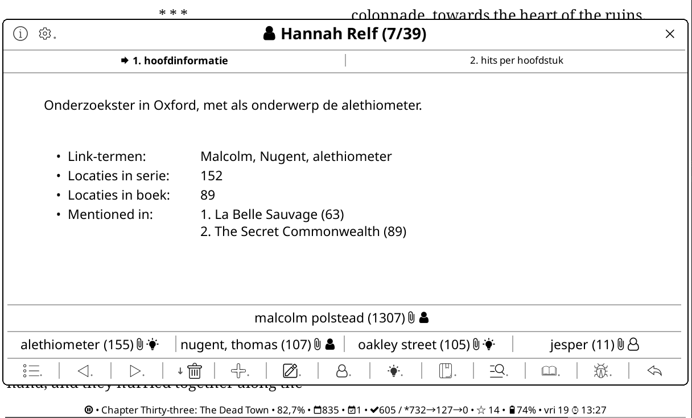
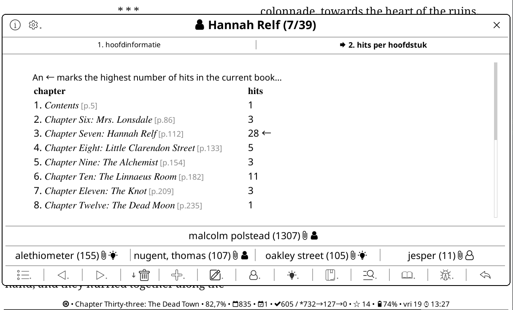
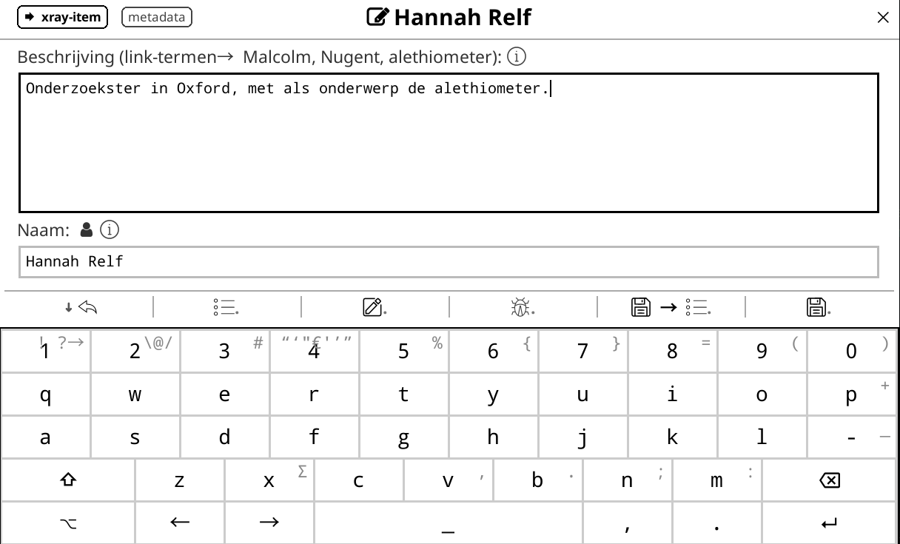
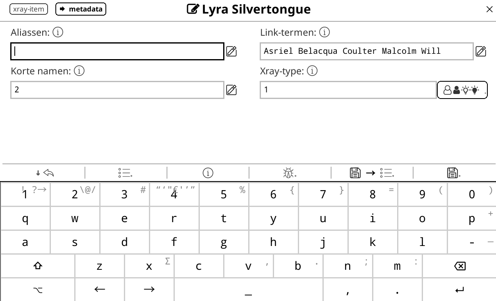
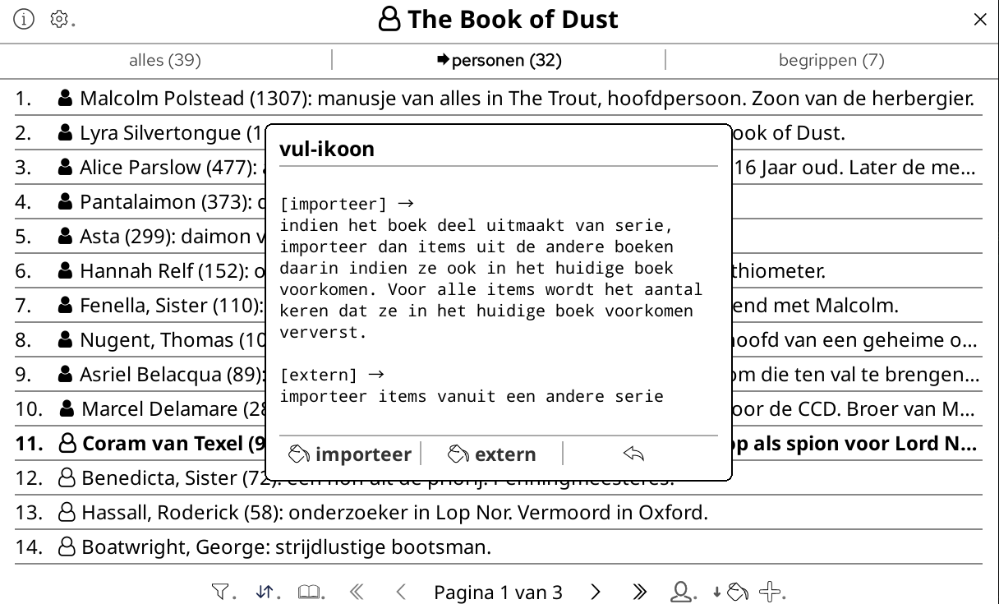
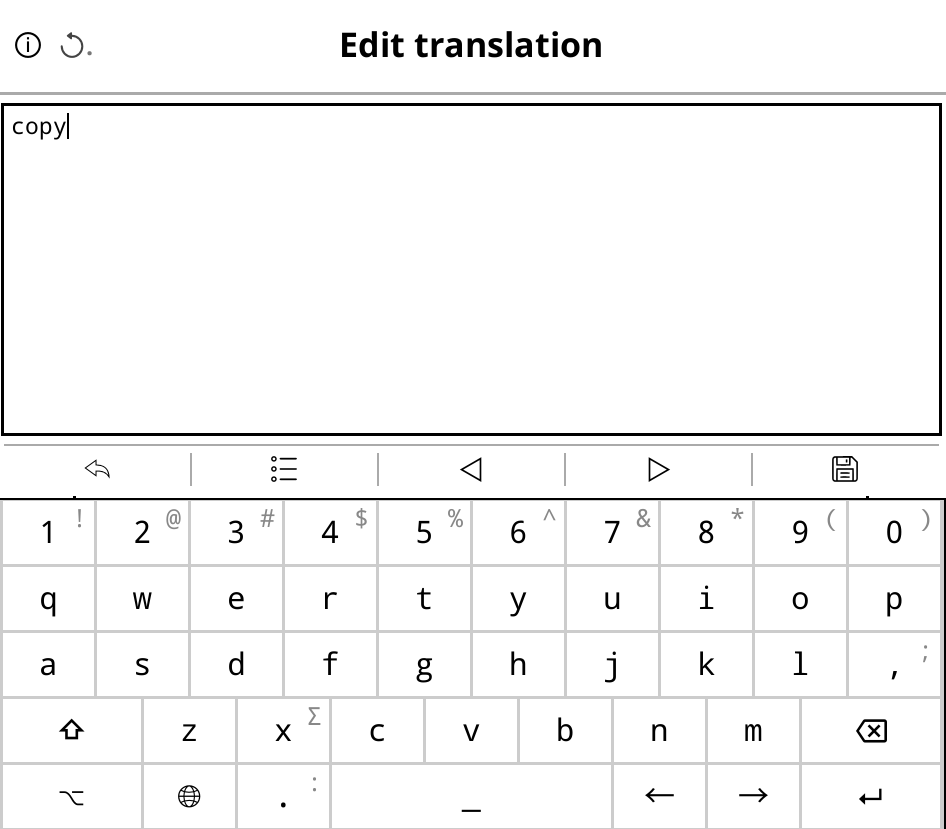

# Dynamic Xray plugin
# Kindle-like functionality for KOReader

A KOReader plugin to view "xray items", i.e. user defined explanations of persons and terms in single books or even entire series:

* This DX plugin was inspired by the X-ray system on Kindles (see explanation
  on [Amazon X-Ray on Kindle | All you need to know - YouTube](https://youtu.be/mreow-OrGsU?si=c_3NhHKBDa1BFEvI)).
* "Terms" in Dynamic Xray (DX) can be names of things, entities, concepts, definitions, places, named events, names of literary or philosophical movements, and much more. It's all up to the imagination of the user...
* DX differs from the Kindle system in that the user can define items dynamically, while on Kindles these items are "baked into" the ebook.
* The advantage of the DX approach is that the user can dynamically add and modify items or link them to other items; the advantage of the Kindle approach is that it isn't error-prone.
* DX can produce false hits, because it uses matching of the words in ebook texts to determine whether Xray items are present. For example: DX will be in trouble if there are two or more persons with the same first name in a book; DX won't be able to differentiate between them. But in at about 95% of cases, the matches shown will be correct.
* All interface texts can be translated by the user.

## Table of contents in this readme
- [Use cases](#use-cases)
  - [Fiction books](#fiction-books)
  - [Non-fiction books](#non-fiction-books)
- [Installation](#installation)
  - [Entering your own translations for the DX interface](#entering-your-own-translations-for-the-dx-interface)
- [Usage tips](#usage-tips)
  - [Adding Xray items](#adding-xray-items)
  - [Displaying help information about the function of buttons](#displaying-help-information-about-the-function-of-buttons)
- [DX in action](#dx-in-action)
    - [Videos](#videos)
    - [Images](#images)
- [DX Settings menu](#dx-settings-menu)
- [Problem solving](#problem-solving)
    - [Buttons in editor not visible](#buttons-in-editor-not-visible)
    - [Notification: DX couldn't be initialized](#notification-that-dx-couldnt-be-initiated)
    - [User has a database filename other than "bookinfo_cache.sqlite3"](#user-has-a-database-filename-other-than-bookinfo_cachesqlite3)
- [Todos / issues to fix](#todos--issues-to-fix)
- [About the code](#about-the-code)
- [Development history and usage](#development-history-and-usage)
- [Icons](#icons)
- [Tips for navigating through the code](#tips-for-navigating-through-the-code)
- [License](#license)

## Use cases

### Fiction books
The user can use DX to keep track for an ebook or an entire series of many persons and terms, mark them as important, to see how they are linked to other items, what are their aliases, in which chapters they are mentioned and how frequent, etc.
### Non-fiction books
The user can use DX for study: to keep track of entities, concepts, definitions, places, named events, names of literary or philosophical movements etc., to see how these are linked to each other, in which chapters they can be found and how frequent, etc.

## Installation

1. Clone this repo somewhere. From there:
2. Copy the folder "extensions" under frontend to the frontend folder of your KOReader installation.
   * **⚠️ NB: Don't overwrite your KOReader frontend folder with the frontend folder from the repository!**
3. Copy xraycontroller.koplugin under the plugins folder to your KOReader plugins folder.
   * **⚠️ NB: Don't overwrite your entire plugins folder!**
4. Copy the svg icons under resources/icons/mdlight to the corresponding folder under your KOReader installation dir.
   * **⚠️ NB: Don't overwrite your original folders and files here!**
5. The "koreader-settings-and-patches" folder in this repository represents the settings folder of your koreader installation. In most cases, this target folder will be named "koreader". In its root you should find settings.reader.lua.
6. In that target folder, create a folder patches if it doesn't exist yet and copy koreader-settings-and-patches/patches/2-xray-patches.lua to that target patches folder.
7. Copy koreader-settings-and-patches/settings/settings_manager.lua to the settings subfolder of the koreader settings folder of your current installation (this folder should already be present and should contain many files, e.g. sqlite3-files for KOReader's databases).
8. **⚠️ Check whether the database filename in your KOReader settings folder is "bookinfo_cache.sqlite3".** If not, go through the additional steps listed in [User has a database filename other than "bookinfo_cache.sqlite3"](#user-has-a-database-filename-other-than-bookinfo_cachesqlite3)

### Updating to new versions

When you clone new versions of DX, make sure you also update the patch file on your device. Otherwise, you might be confronted with crashes...

### Entering your own translations for the DX interface

As of 2025-12-25 translations are now stored in the table xray_translations in the database. This table will be automatically created upon KOReader start. The translations are lazily stored in that table, only when requested.

This will make the code and updates much easier to maintain for me _and_ for cloners... Users can translate texts in the TranslationsManager, which is reachable from the bubbles icon in the:
* top left corner of the list of Xray items
* top left corner of the information popup called with a tap on an Xray marker (lightning or star) in the ebook text
* top left corner of the Xray item viewer dialog
* the most left main menu item → Dynamic Xray → Translate interface

**⚠️ The folder frontend/extensions/translations with in it a .po-file has therefore now been removed.**

## Usage tips

### Adding Xray items

* The patch file adds a button "+ Xray" to the popup dialog for text selections. With this button, you can add new Xray items from the text selection.
* From the list of Xray items (to which you can assign a gesture, for quickly showing it), you can view and edit items, or add new items, by tapping on the plus-icon in the dialog footer.
* When you select a longer text in the ebook and tap on "+ Xray", DX will set this text as the description of the new Xray item. You then only have to type its name in the field below the description.
* By clicking on lightning or star icons in the margins of ebook pages, you can call up an overview of Xray items in resp. the current page or the paragraph with the star icon.
* You can assign a gesture to quickly call up the list of all Xray items in the book or series: cog icon in the main KOReader menu → Taps and gestures → Gesture manager → Multiswipes → select a gesture → Reader → Show xray-items in this book/series
* In the same way, you can also attach a gesture to the action "Add an Xray item".

### Displaying help information about the function of buttons
DX uses mostly buttons with only icons, so without explanatory labels. However, if a button contains a point on the right side of the icon, or a downwards pointing arrow on the left side, this means that you can trigger a popup with help information about the function of that button by longpressing it.
* An arrow means that a button has more than one action available upon longpress.
* A point signifies a one action button.
* These actions can then be executed by tapping on the buttons at the bottom of the help dialog.
* If you don't longpress the main button, which has the help information, but simply tap it, its main function will be immediately triggered.

## DX in action

### Videos

* [See releases](https://github.com/smartscripts-nl/dynamic-xray/releases/tag/videos)

### Images

01 Xray marker in page

02 Xray info dialog after click on marker

02b Tappable popup with linked items after longpressing a name in the ebook

03 List of Xray items

04 Xray item viewer tab 1

05 Xray item viewer tab 2

06 Xray item editor tab 1

07 Xray item editor tab 2

08 Help info for buttons

09 Interface translations list

10 Translations navigator

11 Editing a translation

12 Help info for translations editor

## DX Settings menu

* Open the KOReader main menu
* Go to most left main item → Dynamic Xray (NB: this item is positioned at the bottom of the items, so you might have
  to navigate to the next subpage) → Settings
* This same settings menu is also reachable through the cog icon at the top left of these three dialogs:
    * the Xray items list
    * the Xray item viewer
    * the popup dialog after you clicked upon a lightning or a star marker in the text of the e-book

## Problem solving

### Buttons in editor not visible

In the add/edit Xray item dialog, under the first tab "xray-item", some users don't see buttons, because they are hidden under the keyboard. You can rectify this by:

* Closing the dialog
* Go to the [DX Settings menu](#dx-settings-menu)
* Tap on editor_vertical_align_buttontable and set this value to false
* Now re-open the Xray add or edit form

### Notification that DX couldn't be initiated

This lets the user know that somewhere in KOReader (maybe DX, maybe another plugin) an error occurred, which prevented DX from initializing. Alas, these error conditions are very hard to debug for me from a distance...

### User has a database filename other than "bookinfo_cache.sqlite3"

The default database filename in the KOReader settings dir will almost always be "bookinfo_cache.sqlite3". But apparently **⚠️ some
users have a different database filename**, with a prefix string attached by some other plugin at the front, e.g. "
PT_bookinfo_cache.sqlite3". In that case:

1. Go to the [DX Settings menu](#dx-settings-menu)
2. Enter and save the correct database file name for your installation in the setting "database_filename".
3. KOReader will automatically be reloaded and then create the xray_items table in your database.

## Todos / issues to fix

* Maybe occurences in chapters are not indexed when DX is run in book mode (not for an entire series). I have to investigate...

## About the code

* Dynamic Xray uses a stripped version of my personal extensions system for KOReader.
* DX is added by patching the stock KOReader code, so you don't have to modify the code of the basic KOReader version.
* The DX plugin is structured to resemble an MVC structure:
    * M = XrayModel > data handlers: XrayDataLoader, XrayDataSaver, XrayFormsData, XraySettings, XrayTappedWords and XrayViewsData (extensions)
    * V = XrayUI, XrayTranslations and XrayTranslationsManager, XrayDialogs and XrayButtons (extensions)
    * C = XrayController (plugin)
* The XrayHelpers extension of DX version 1.0 does not exist anymore, its methods have been redistributed over the above extensions. 
* In xray-info.lua you can find some explanations for programmers about the inner workings of DX. This file doesn't have a function in the plugin, is meant to be purely informational.
* Since the KOR extensions system uses many heavily modified stock KOReader modules and widgets, these modified files are loaded instead of the stock versions from the subfolders "modules" and "widgets" under the "extensions" folder.
* DeepWiki.com has an extensive analysis of the DX system. See .

## Development history and usage

See [Dynamic Xray plugin · koreader/koreader · Discussion #12964 · GitHub](https://github.com/koreader/koreader/discussions/12964)
for the development history of this plugin and for Dynamic Xray usage examples by screenprints and screencasts.

## Icons

Most icons used by DX were downloaded from [Online Webfonts](https://www.onlinewebfonts.com/icon/), and some from [SVG Repo](https://www.svgrepo.com/). In some cases, I've renamed these icons, to clarify their function in DX.

## Tips for navigating through the code

* Use a JetBrains IDE (e.g. PhpStorm) with the extensions EmmyLua and Better Highlights. With that you get clickable comments and very good type hints, which makes it much, much easier to navigate through the code.

* Also, with Better Highlights, you can colorize comments differently depending on the use case, for much improved readability.

* In Better Highlights settings set (( and )) as wikilink start and end - the default is [[ and ]] -, so you can add clickable comments to --(( )) lua commented blocks.

## License

GNU General Public License (GPLv3): open source software, free to use, modify and distribute your version. Naming me as the author of the very first version would be nice.
See license.md in this repository or https://www.gnu.org/licenses/gpl-3.0-standalone.html for more details of the license.
